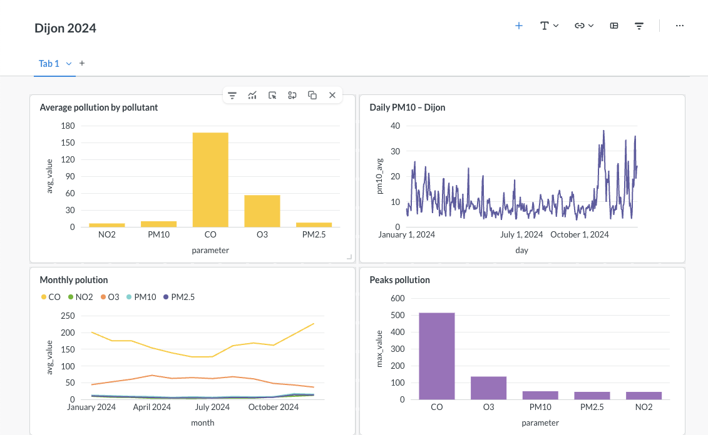
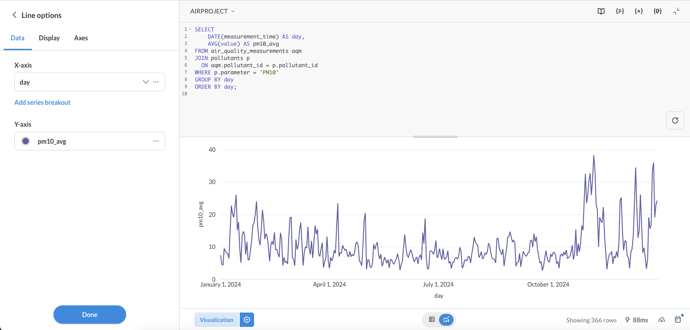
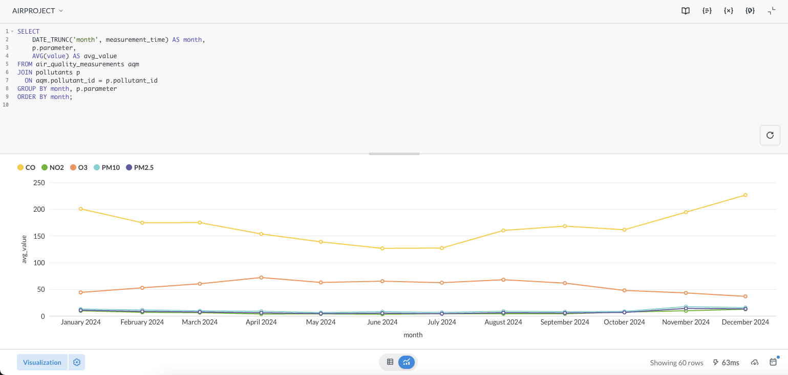
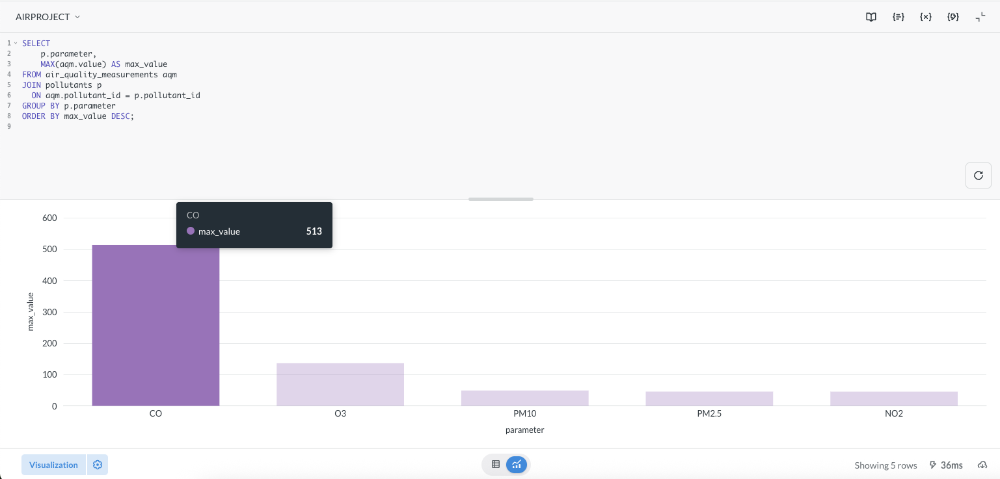

#  Air Quality Data Engineering Platform — Dijon (2024)

End-to-end **data engineering project** for collecting, validating, transforming, storing and analyzing real environmental air-quality data.

This project demonstrates the full lifecycle of a modern data platform:
from API ingestion → ETL pipeline → PostgreSQL data warehouse → SQL analytics → BI dashboards.

---

## The project focuses on:

* reliable data ingestion
* data quality validation
* analytical data modeling (star schema)
* SQL-based analytics
* dashboard visualization
* reproducible Docker environment

---

##  Architecture

```
API (Open-Meteo) -> Data ingestion (Python)  -> Validation layer -> Transformation layer -> PostgreSQL Data Warehouse -> SQL Analytics -> Metabase Dashboards
      
```


##  Data Source

**Open-Meteo Air Quality API**

* Hourly measurements
* Government and European monitoring stations
* No API key required
* High data reliability

Pollutants included:

* PM10
* PM2.5
* NO₂
* O₃
* CO

---

##  Technologies Used

### Data Engineering

* **Python**
* **Pandas**
* **REST APIs**
* **ETL pipeline design**

### Database

* **PostgreSQL 15**
* **Star schema modeling**
* **Indexes & constraints**

### Analytics

* **SQL**
* **Time-series analysis**
* **Aggregations & KPIs**

### BI & Visualization

* **Metabase**

### Infrastructure

* **Docker**
* **Docker Compose**

---


###  Star Schema

**Dimensions**

* `locations`
* `pollutants`

**Fact Table**

* `air_quality_measurements`

```sql
air_quality_measurements
 ├── location_id → locations
 ├── pollutant_id → pollutants
 ├── measurement_time
 └── value
```

This structure enables:

* fast analytics
* clean joins
* scalable design
* BI-ready datasets

---

##  Dashboards

The project includes interactive dashboards built with **Metabase**.

### Example analyses:

* 📈 Daily PM10 evolution
* 📊 Monthly pollution trends
* 🔥 Maximum pollution peaks
* ⚖️ Average pollution per pollutant

### 📸 Screenshots

### MAIN DASHBOARD 



#### Daily PM10



#### Pollution Peaks



#### Max Pollutants



---

## 🛠️ Installation Guide

### ✅ Prerequisites

* Python **3.9+**
* Docker Desktop
* Git

---

### 1️⃣ Clone repository

```bash
git clone https://github.com/AdilHamidii/Dijon_AirPollution.git
cd Dijon_AirPollution
```

---

###  Create Python environment

```bash
python3 -m venv venv
source venv/bin/activate
```

---

###  Install dependencies

```bash
pip install -r requirements.txt
```

---

###  Run ETL pipeline

```bash
python fetch/fetch_air_quality.py
python validate/validate.py
python transformation/transform.py
```

This generates:

```
data_transformed.csv
```

---

###  Start Docker services

```bash
docker compose up -d
```

Containers started:

* PostgreSQL
* Metabase

---

###  Create database schema

```bash
docker exec -it airquality_postgres psql -U air -d airquality
```

```sql
\i /data/schema.sql;
```

---

###  Load data into warehouse

```bash
python load_to_postgres.py
```

Verify:

```sql
SELECT COUNT(*) FROM air_quality_measurements;
```

---

###  Open Metabase

```
http://localhost:3000
```

Database connection:

```
Host: postgres
Port: 5432
Database: airquality
User: air
Password: air
```

---

## Example Analytics SQL

```sql
SELECT
    DATE(measurement_time) AS day,
    AVG(value) AS avg_pm10
FROM air_quality_measurements aqm
JOIN pollutants p
  ON aqm.pollutant_id = p.pollutant_id
WHERE p.parameter = 'PM10'
GROUP BY day
ORDER BY day;
```

---

## Skills Demonstrated

* API ingestion & handling
* Data validation rules
* ETL pipeline architecture
* Data normalization
* Star schema modeling
* PostgreSQL analytics
* SQL optimization
* Dockerized environments
* BI dashboard design

---


## 👤 Author

**Adil Hamidi** 
AIs Used : Claude Opus 4.5 , ChatGPT 5.2
Computer Science Student 
Université Bourgogne Europe (Dijon)

---


